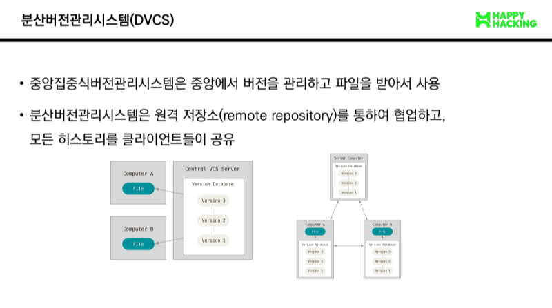
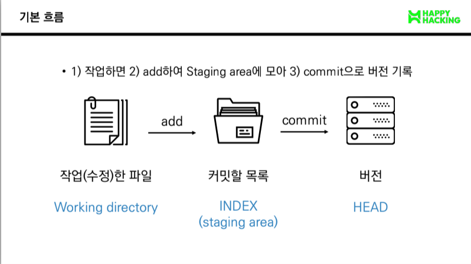
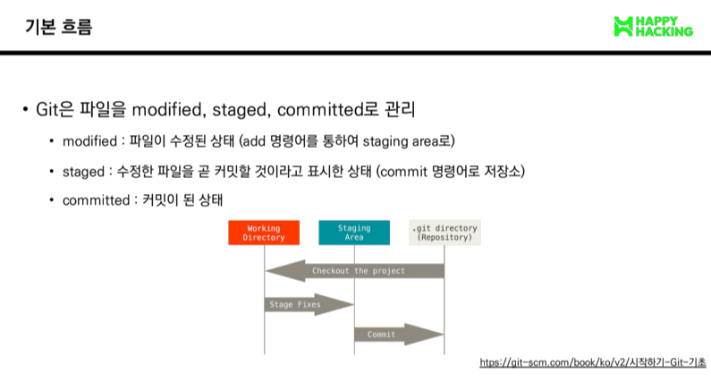

# Git bash

## GUI : 그래픽 기반의 인터페이스

## CLI : 명령 기반의 인터페이스

```
-pwd(print working directory): 현재 디렉토리 출력
-cd 디렉토리이름(chnage directory) : 디렉토리 이동
-ls(list) : 목록
-mkdir(make directory) : 디렉토리 생성
-touch : 파일 생성
-rm 파일명: 파일 삭제하기
    - rm -r 폴뎌명: 폴더 삭제하기
```

# Git



---



## $ git add <file>

```
- working directory상의 변경 내용을 staging area에 추가하기 위해 사용

    - untracked 상태의 파일을 staged로 변경

    - modified 상태의 파일을 staged로 변경
```

## $ git commit -m'<커밋메시지>

```
- staged 상태의 파일들을 commit을 통해 버전으로 기록
```



---

## 현재 상태 알고 싶을 때

```
$ git status : Working Directory(1통) or Staging Area(2통)

$ git log : Repository(3통)
```
